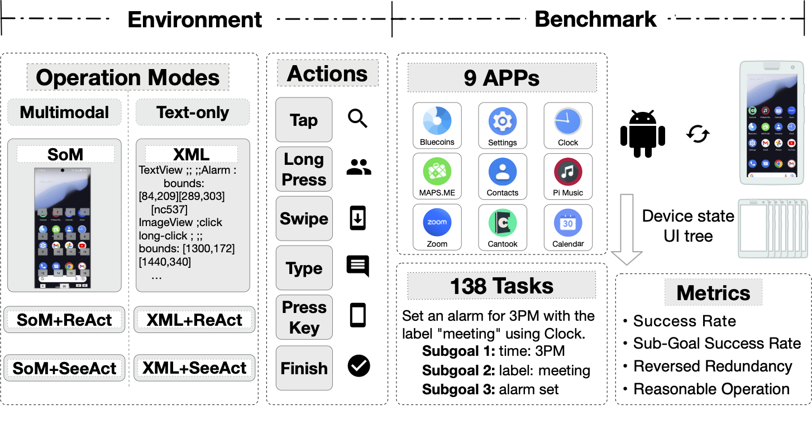
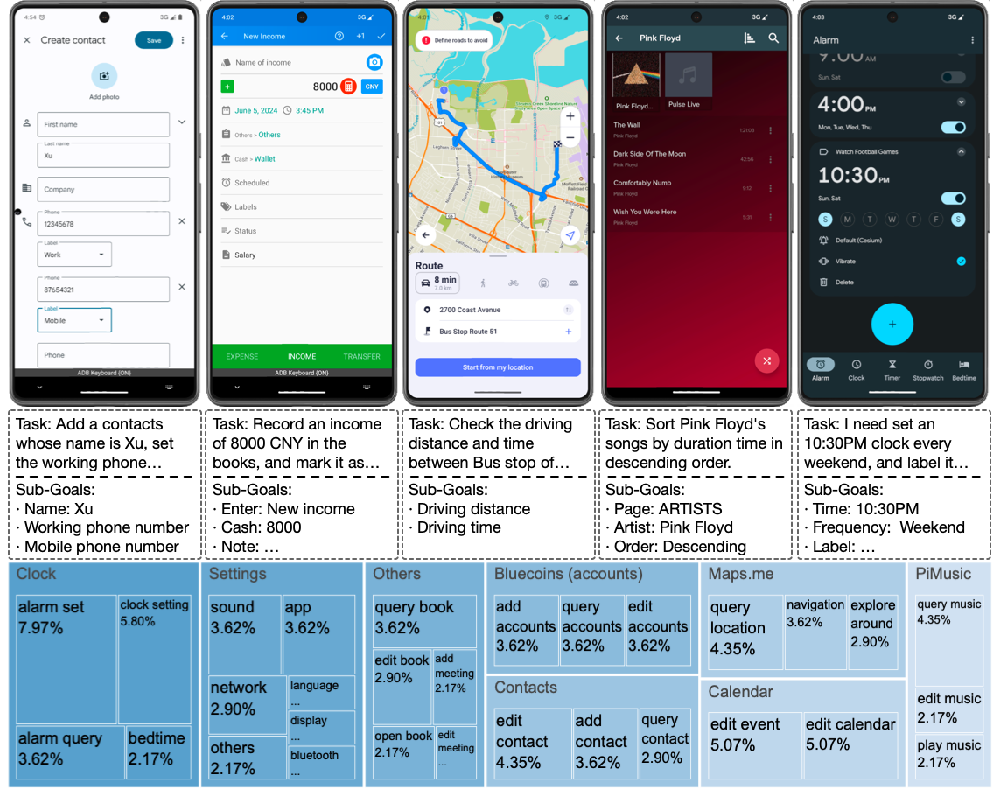
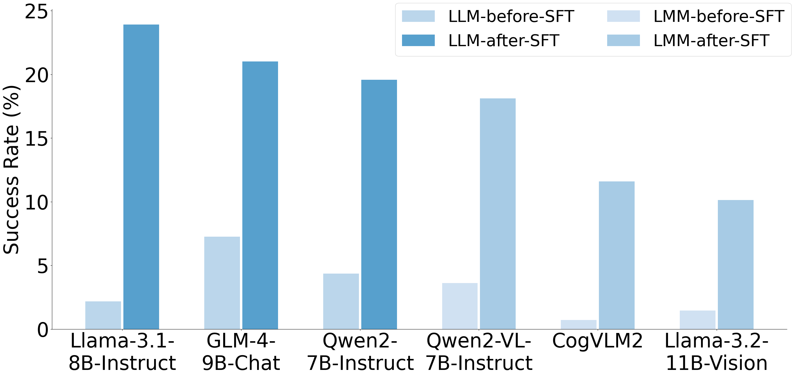

# AndroidLab: Training and Systematic Benchmarking of Android Autonomous Agents

<p align="center">
   <a href="https://arxiv.org/abs/2410.24024" target="_blank">📃 Paper </a>
</p>

英文版本的 README 请点击 [这里](README.md)。

我们开发了一个 Android 代理框架AndroidLab。它包括一个操作环境和一个可复现的基准。AndroidLab 基准包括预定义的 Android 虚拟设备和在这些设备上构建的 9 个应用程序中的 138 个任务。

该代码库是环境和测试基准的代码框架。我们提供了两种执行模式：在 Mac（arm64）上的 AVD 模式和在 Linux（x86_64）上的 Docker 模式。您可以根据我们的框架自由添加或修改新任务或 Android 镜像。我们提供了完整的评估框架，可用于评估各种 Android agents 的性能。




# 基准测试组件

在我们的实验中，我们利用了一系列应用程序来进行各种测试。选择的移动应用程序如下：

- **Bluecoins**: 一个个人财务管理应用程序，用于跟踪支出和收入。
- **Calendar**: 一个日历应用程序，帮助组织日程安排和设置提醒。
- **Cantook**: 一个电子书阅读器，用于存储、管理和阅读电子书。
- **Clock**: 一个时钟应用程序，用于显示时间、设置闹钟和使用秒表。
- **Contacts**: 一个联系人管理应用程序，用于存储和组织联系信息。
- **Maps.me**: 一个离线地图应用程序，用于导航和探索位置。
- **PiMusic**: 一个音乐播放器应用程序，用于组织和播放本地存储的音乐文件。
- **Settings**: 一个设置应用程序，用于配置设备设置和偏好。
- **Zoom**: 一个视频会议应用程序，用于主持和参加在线会议。

这些应用的选择经过了多次迭代，以确保它们适合我们的评估目的。最终选择的关键标准是每个应用必须能够独立运行，不需要互联网连接或用户账户登录。这确保了评估可以在相同条件下始终如一地重复进行，消除了外部依赖并减少了隐私泄露的风险。因此，这种方法保持了我们结果的可靠性和可重复性。



# 排行榜

XML 和 SoM 模式的主要结果。SR、Sub-SR、RRR 和 ROR 分别代表成功率、子目标成功率、反向冗余率和合理操作率。对于所有这些指标，值越高越好。**-ft** 代表一个指令微调模型。在每种模式下，**加粗** 代表最好的结果。


使用 Android Instruct 数据集，我们训练了六个开源纯文本和多模态模型，LLM 的平均成功率从 4.59% 提高到 21.50%，LMM 的平均成功率从 1.93% 提高到 13.28%，达到了与闭源模型相当的性能水平。



# 快速开始

## 自动评估

我们提供了两种测试方法：Mac上的AVD（arm64）和Linux上的Docker（x86_64）。

### 环境配置

克隆此仓库并安装依赖项。

```bash
cd /path/to/your/repo
conda create -n Android-Lab python=3.11
conda activate Android-Lab
pip install -r requirements.txt
```

如果您使用的是Mac上的AVD（arm64），请参考[这里](docs/prepare_for_mac.md)来设置环境。

如果您使用的是Linux上的Docker（x86_64），请参考[这里](docs/prepare_for_linux.md)来设置环境。

### 运行自动评估Pipeline

运行：

```bash
python eval.py -n test_name -c your path to config.yaml
```

每个问题的具体输出保存在`./logs/evaluation/test_name`下，评估结果保存在`output`文件夹中。

如果您只想运行几个问题进行测试，可以参考：

```bash
python eval.py -n test_name -c your path to config.yaml --task_id taskid_1,taskid_2,taskid_3
```

我们支持并行测试。请注意，您需要提前确认有足够的内存和存储空间。每个并发测试大约占用6G内存和9G存储空间。

```bash
python eval.py -n test_name -c your path to config.yaml -p 3
```

每个问题的task_id可以在`evaluation/config`中找到。

使用以下代码生成评估结果：

```bash
# gpt-4o-2024-05-13评测:
export OPENAI_API_KEY='your-api-key-here'
python generate_result.py --input_folder ./logs/evaluation/ --output_folder ./logs/evaluation/ --output_excel ./logs/evaluation/test_name.xlsx --judge_model gpt-4o-2024-05-13

# glm4评测:
python generate_result.py --input_folder ./logs/evaluation/ --output_folder ./logs/evaluation/ --output_excel ./logs/evaluation/test_name.xlsx --judge_model glm4 --api_key your api key
```

你需要根据需求填写 judge model和api_key或 api_base。我们现在支持gpt-4o-2024-05-13 和 glm4。generate_result.py将在--input_ir下生成所有测试结果的Excel文件，包含每个问题的详细结果。

如果你希望基于Androidlab进行进一步的开发，包括更改agent的基座模型，增加任务和改变AVD image，请参考[这里](docs/modify_androidlab.md)

# 引用

```
@misc{xu2024androidlabtrainingsystematicbenchmarking,
      title={AndroidLab: Training and Systematic Benchmarking of Android Autonomous Agents}, 
      author={Yifan Xu and Xiao Liu and Xueqiao Sun and Siyi Cheng and Hao Yu and Hanyu Lai and Shudan Zhang and Dan Zhang and Jie Tang and Yuxiao Dong},
      year={2024},
      eprint={2410.24024},
      archivePrefix={arXiv},
      primaryClass={cs.AI},
      url={https://arxiv.org/abs/2410.24024}, 
}
```